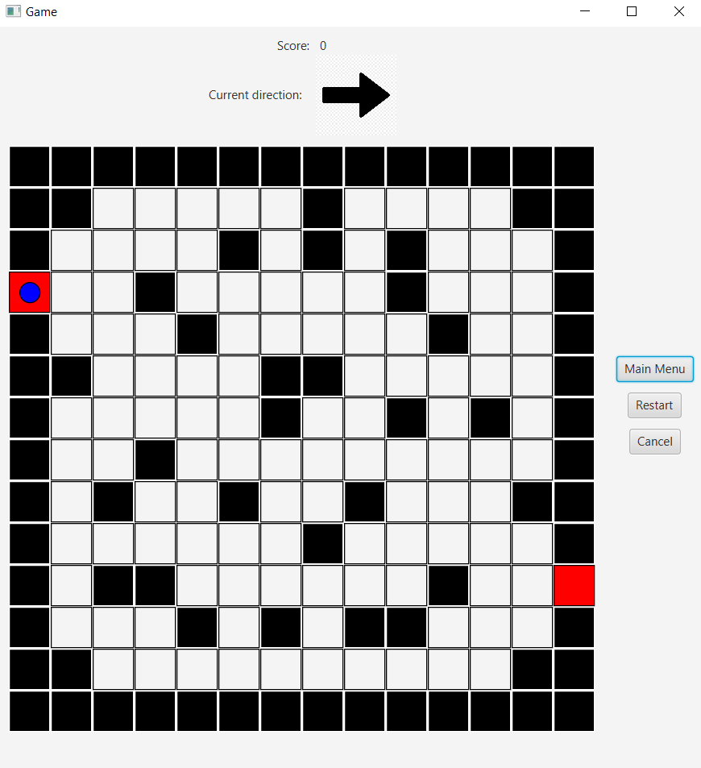

# **MAVEN PROJECT**

## This is a java/maven based project of a game, where you can only go straight and to the right.

---

The goal in this game is to reach the target on the board with your character by **only** going straight or turn right.

The game is written in pure java language, with [Apache - Maven](https://maven.apache.org/) project management and [javafx GUI](https://openjfx.io/)

---

To run the game you can use the jar file in the target directory, or if you changed something in the code use the following commands:

- `mvn compile`
- `mvn exec:java`

To build the project you can use the `mvn package` command, which will build it into a JAR file in the target directory that can be used on any platform.
You can run it for example from Terminal/command prompt with the `java -jar mavenproject-1.0.jar` if you have [java](https://www.java.com/en/) accessible on your PC or just simply doubleclick it.

---

## Dependencies:

The game depends on javafx for the GUI and Jackson for the saving/loading among other things like tinylog2 for logging.

- [maven](https://maven.apache.org/)
- [javafx](https://openjfx.io/)
- [jackson](https://github.com/FasterXML/jackson)
- [tinylog2](https://tinylog.org/v2/)
